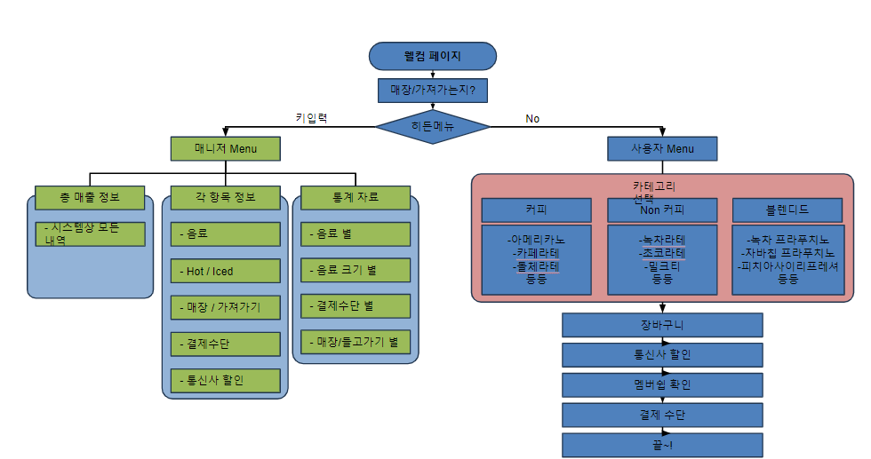
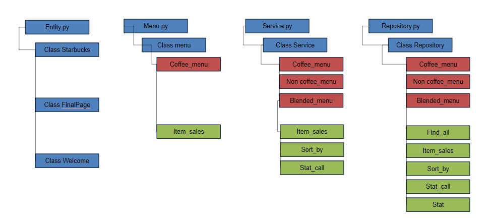
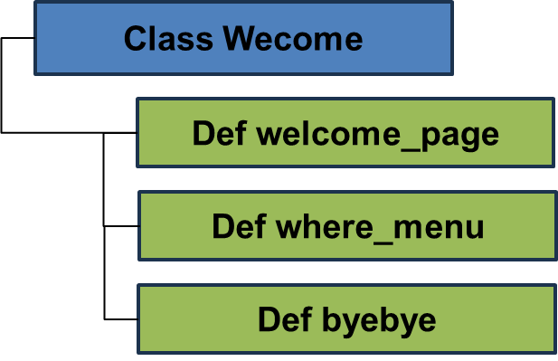

# DA36-mini1-seotarbucks

<!-- 유영준 start -->

<!-- 유영준 end -->

<!-- 이예진 start -->
## **요구 사항 명세** 
### ~ 사용자 메뉴 ~

5. 커피, 논-커피 선택 시 Hot/Cold 옵션 화면을 보여주세요.
    1. 블렌디드 선택 시 Hot/Cold 옵션 화면을 보여주지 마세요.
6. Hot/Cold 옵션에서 Cold 선택 시 얼음 양을 선택하는 옵션 화면을 보여주세요.
    1. Cold 선택 시 가격이 500원 추가되게 해주세요.
7. 수량을 입력하는 옵션 화면을 보여주세요.
8. 당도, 사이즈를 입력하는 옵션 화면을 보여주세요.
	1. 당도 를 더 달게 하거나 사이즈를 업그레이드 하면 추가금이 발생하게 해주세요.
9. 옵션을 모두 선택하였다면 선택한 메뉴가 한번에 보이게 해주세요.
10. 메뉴를 추가로 선택할지 물어보는 창이 나오게 해주세요.
11. 메뉴 추가 시 3번부터 다시 실행되게 해주세요.
	1. 메뉴 추가가 없을 시 장바구니 화면을 보여주세요.
12. 장바구니를 확인 했다면 결제 화면을 보여주세요.
13. 결제 화면에서는 통신사 할인 여부를 선택하는 화면을 보여주세요.
	1. 통신사 할인 선택 시 할인이 적용된 결제 내역 화면을 보여주세요.
14. 확인이 완료되었다면 멤버쉽 적립 여부를 물어보는 화면을 보여주세요.
	1. 멤버쉽이 있다면 포인트 적립을 해주세요.
	2. 멤버쉽이 없다면 회원가입 여부를 물어봐 주세요.
	3. 회원가입을 원하시면 번호를 물어봐서 가입을 도와드리고 적립도 진행해 주세요.
15. 결제 수단을 물어보는 화면을 보여주세요.
16. 결제가 완료되면 주문 번호가 나온 후 키오스크가 종료되게 해주세요.

## **요구 사항 명세**  
### ~ 관리자 메뉴 ~
1. 카테고리 화면에서 화면에 표시되지는 않지만 특별한 키를 누르면 관리자 모드 화면을 보여주세요. 
2. 관리자 모드에 들어가기 위해서는 비밀번호를 입력하게 해주세요.
3. 비밀번호가 맞다면 **매출 정보 조회, 매출 정보 엑셀 내보내기, sort by, Statistics** 가 있는 관리자 모드가 나옵니다. 
    1. **매출정보 조회** 선택 시 주문 번호 순으로 정렬된 매출 내역을 보여주세요.
    2. **매출 정보 엑셀 내보내기** 선택 시 3-1번에 나온 정보를 엑셀로 만들어주세요.
    3. **Sort By** 선택 시 **메뉴명, Hot/Cold, to-go, 결제수단, 멤버쉽 회원, 통신사 할인**별로 정렬된 매출 내역을 보여주세요.
    4. **Statistics** 선택 시 **음료, 사이즈, Hot/Cold, 결제수단, 통신사할인, to-go**별로 매출내역 통계를 보여줍니다.

## **Flow Chart**

### class 별

<!-- 이예진 end -->

<!-- 김진수 start -->
## 4. 코드 구조
### 4.1 Welcome page.

<!-- 김진수 end -->

<!-- 유영준 start -->
<iframe width="560" height="315" src="https://www.youtube.com/embed/PY3MDnb6CKo?si=GnHmwhcMConv7Pnv" title="YouTube video player" frameborder="0" allow="accelerometer; autoplay; clipboard-write; encrypted-media; gyroscope; picture-in-picture; web-share" referrerpolicy="strict-origin-when-cross-origin" allowfullscreen></iframe>

<!-- 유영준 end-->
